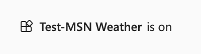

# 演習: コネクタ アクションの作成

この演習では、次のことを行います。

- Copilot Studio でコネクタ アクションを作成する
- Microsoft Teams でコネクタ アクションをテストする
- コネクタ アクションを保存して発行する

## タスク 1: Copilot Studio でコネクタ アクションを作成する

このタスクでは、MSN 天気 コネクタのコネクタ アクションを構成します。

1. [Copilot Studio](https://copilotstudio.microsoft.com) に移動し、プロンプトが表示されたら、職場または学校のアカウントにサインインします。 ウェルカム メッセージはスキップします。

    **注:** 初めて Copilot Studio を開くと、最初のコパイロットを作成するためのチャット インターフェイスが表示されることがあります。 この場合は、**[…]** を選択します。 右上のメニュー ( **[作成]** ボタンの横) をクリックし、**[コパイロット作成のキャンセル]** を選択してチャット インターフェイスを終了し、Copilot Studio のホーム ページを表示します。
1. 左のナビゲーションで、**[Library]** を選択します。 ここでは、既存のアクションとコネクタの一覧を表示し、新しいアクションとコネクタを作成できます。
1. 上部にある **[Add an item]** を選択します。  メニューには、Copilot for Microsoft 365 を拡張するための 2 つのオプションが一覧表示されます。
:::image type="content" source="../Media/extend copilot options.png" alt-text="ウィンドウには、Copilot を拡張するための 2 つのオプションが一覧表示されます。コパイロットを作成するか、アクションを作成します。":::
2. **新しいアクション** を選択します。
3. **[Connector]** を選択して、コネクタ アクションのウィザードを開きます。
4. コネクタとして **[MSN 天気]** を選択します。
5. 説明を**確認**します。

    > [!IMPORTANT]
    > Copilot はこれを使用してユーザー メッセージをプラグインと一致させるので、この説明は非常に重要です。 適切な説明がない場合は、Copilot によってコネクタ アクションがトリガーされない可能性があります。

1. [**次へ**] を選択します。
1. **現在の天気を取得する** アクションを選択します。
1. アクションの説明を**確認**します。

    > [!IMPORTANT]
    > 次の画面で、アクションの説明を確認します。 Copilot はこれを使用して、ユーザー メッセージとアクションを照合するため、このアクションの説明は非常に重要です。 適切なアクションの説明がない場合、Copilot によって間違ったアクションがトリガーされる可能性があります。

1. [**次へ**] を選択します。
1. すべての入力と出力の説明を**確認**します。

    > [!IMPORTANT]
    > 次の画面で、入力と出力の説明を確認します。 Copilot はコネクタ (入力) をトリガーし、適切な応答 (出力) を書き込む目的でこれらを使用するため、これらの入力と出力の説明は非常に重要です。 適切な入力と出力の説明がない場合、Copilot がコネクタを正しくトリガーしないか、適切な応答を返さない可能性があります。

1. [**次へ**] を選択します。
1. 次に、必要に応じてアクションを追加できる画面が表示されますが、この場合はスキップして **[次へ]** を選択します。

## タスク 2: Microsoft Teams でコネクタ アクションをテストする

このタスクでは、Microsoft Teams での Microsoft 365 Copilot のタスク 1 で構成したコネクタ アクションをテストします。


1. 既存の接続がある場合は、その接続を選択するか、**[New connection]** を選択して MSN 天気コネクタ用の新しい接続を作成します。
1. **[New connection]** メニューで **[Create]** を選択します。
1. **[Selected connection]** で、ドロップダウン メニューから新しい接続を選択できるようになりました。
1. **[Test action]** ボタンを選択します。

    > [!NOTE]
    > これにより、Microsoft Teams にデプロイされるプロセスがトリガーされ、コネクタ アクションをテストできるようになります。

1. **[Open to test]** を選択して、テストを行います。

    > [!NOTE]
    > これにより、新しいブラウザー タブが開き、Microsoft Teams を起動しようとします。

1. Microsoft Teams の起動を試みるポップアップで **[キャンセル]** を気にせず選択してください。
1. **[代わりに Web アプリを使用]** を選択します。

    > [!NOTE]
    > これにより、Microsoft Teams で Microsoft 365 Copilot が開きます。

1. Teams での Copilot のメッセージ作成領域から、送信アイコンの横にある **プラグイン** アイコンを選択します。
1. **Test-MSN 天気**のプラグインを見つけて、トグルを選択して有効にします。

    > [!NOTE]
    > これにより、次のメッセージが表示されます。

    


1.  次のメッセージを Microsoft 365 Copilot に送信し、目的の場所と単位の値を入力します。

    ```text
    What is the current weather in <your location> in <celsius/fahrenheit> according to MSN Weather?
    ```

1. すべてがうまくいっていれば、Copilot はプラグインを使用してメッセージで応答します。  

   

   **注:** Copilot でプラグインを使用する前にアクセス許可のダイアログが表示される場合があります。  **[Always allow]** を選択して、Copilot でプラグインを使用できるようにします。

   :::image type="content" source="../Media/test-msn-weather-allow.png" alt-text="プラグインの使用についてアクセス許可のダイアログを表示する Copilot のスクリーンショット。":::

## タスク 3: コネクタ アクションを保存して発行する

このタスクでは、コネクタ アクションを保存して発行します。

Copilot Studio で中断した場所を見てみましょう。

1. ウィザードで **[Next]** を選択すると、コネクタ アクションが発行されます。

    > [!NOTE]
    > 次の画面で、詳細画面に移動するか、保存して閉じることができます。 メッセージに示されているように、アクションがコパイロット エクスペリエンスに表示されるまでに数分かかることがあります。

      
   
1. **保存して閉じる** を選択します。

これで、コネクタ アクションを構成して発行することができました。
